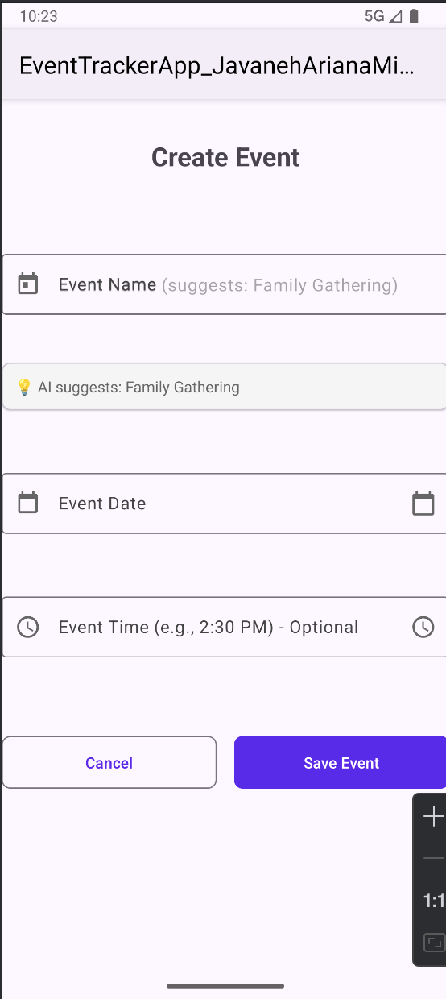

# EventTrackerApp – CS‑499 Capstone ePortfolio
**Author:** Javaneh Ariana Mikhak  

Welcome to my CS‑499 ePortfolio, showcasing my growth as a computer scientist through three key enhancement areas:  
- **Software Design & Engineering**  
- **Algorithms & Data Structures**  
- **Databases**

This repository contains:  
- Original and enhanced artifacts of my **EventTrackerApp**
- Enhancement narratives  
- Professional journals and reflections  
- Screenshots demonstrating functionality  
- Code review video (screencast)
- The code for my project under the branch named `eventtracker-app` [link](https://github.com/javanehmikhak/s25cs499/tree/eventtracker-app)

---

## 📄 Professional Self‑Assessment
[Download PDF](./Professional_Self_Assessment.pdf)

This document introduces my skills, professional goals, and reflections on completing the Computer Science program. It explains how the artifacts in this portfolio demonstrate proficiency in:  
- Collaboration and communication  
- Algorithms and data structures  
- Software engineering and databases  
- Security and professional practice

---

## 💡 Artifact Enhancements

### **1. Software Design & Engineering**
- **Enhancements:** MVVM refactoring, AI‑based event name suggestions, Material Design 3 updates  
- **Narrative:** [Milestone Two – Software Design and Engineering](./Milestone%20Two-%20Software%20Design%20and%20Engineering%20Enhancement%20Narrative.pdf)  
- **Highlights:** Improved maintainability, modernized UI, user‑friendly event creation flow.

### **2. Algorithms & Data Structures**
- **Enhancements:** Replaced ArrayList iteration with **PriorityQueue** and **HashMap**, added event conflict detection and dynamic sorting  
- **Narrative:** [Milestone Three – Algorithms and Data Structures](./Milestone%20Three-%20Enhancement%20Two-%20Algorithms%20and%20Data%20Structure%20Narrative.pdf)  
- **Highlights:** Optimized event retrieval and scheduling, supported multiple sort/filter options.

### **3. Databases**
- **Enhancements:** Normalized **SQLite database**, optimized queries, added **CSV export** functionality  
- **Narrative:** [Milestone Four – Databases](./Milestone%20Four-%20Enhancement%20Three-%20Databases%20Narrative.pdf)  
- **Highlights:** Reliable event storage, data portability, efficient query handling.

---

## 📸 Screenshots

| Feature                                | Screenshot |
|----------------------------------------|-----------|
| Event list sorted and displayed         |  |
| AI suggestion during event creation     |  |
| User profile with CSV export            |  |
| Sorting options dialog                  |  |
| Permission management                   |  |
| Conflict detection notification         |  |
| CSV export in action                    |  |

---

## 🎥 Video Walkthrough
[Watch Screencast](./CS499%20Module%20Two%20Javaneh%20Ariana%20Mikhak.mp4)

---

## 🗂 Additional Materials
- [Professional Journals Compilation](./Professional%20Journals%20Compilation.pdf)  
- Original source code and all milestone narratives included in repository.  

---

This ePortfolio demonstrates my readiness to enter the computer science field by showcasing my growth in software engineering, algorithmic reasoning, database management, and secure development practices.
